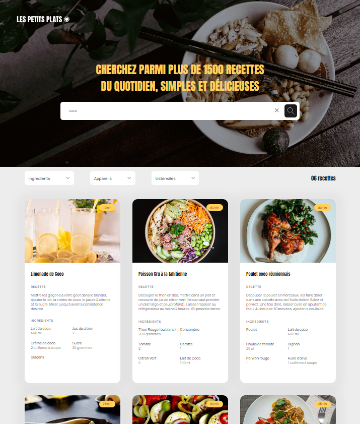

# Les petits plats

## Développez un algorithme de recherche en JavaScript

Projet 7 du parcours "**Développeur d'application** - JavaScript React" d'OpenClassrooms

### 📚 Contexte

**Les petits plats** est spécialisée dans l'édition de livres de cuisine depuis plusieurs année et souhaite désormais réaliser son propre site de recettes de cuisine.  
En tant que freelance missionnée par l'entreprise “Les petits plats” au poste de développeuse Front-end, j'ai eu la mission d'implémenter la maquette et de mettre en place les filtres de recherche. 
Le site comporte deux zones de recherche :

<ul>
<li>une principale qui filtre sur le titre, les ingrédients et la description et une avancée.</li>
<li>une avancée par tags (ingrédients, appareils et/ou ustensiles)</li>
</ul>

La priorité absolue est la **fluidité du moteur de recherche**.  

Dans ce contexte j'ai implémenté deux algorithmes, pour la recherche principale, en vue de les comparer et sélectionner le plus performant.  
Le premier utilise les boucles natives while et for (voir la branche 'recipe-filters-v1').  
Le second s'appuie sur les Array method de JavaScript (voir la branche 'recipe-filters-v2')

### 💡 Technologies et modèles

HTML5/CSS3  
Sass  
JavaScript  
Figma ( [voir la maquette](https://www.figma.com/file/LY5VQTAqnrAf0bWObOBrt8/Les-petits-plats---Maquette-2.0?type=design&node-id=0-1&mode=design) )  
Modèle MVC

### 📄 Documentation

([Voir le benchmark des algorithmes](https://jsben.ch/eS8bA))
([Voir le document d'investigation](assets/docs/Ganzin_Segolene_1_fiche_investigation_122023.pdf))

### 🏆 Compétences évaluées

➡ Analyser un problème informatique  
➡ Développer un algorithme pour résoudre un problème  
